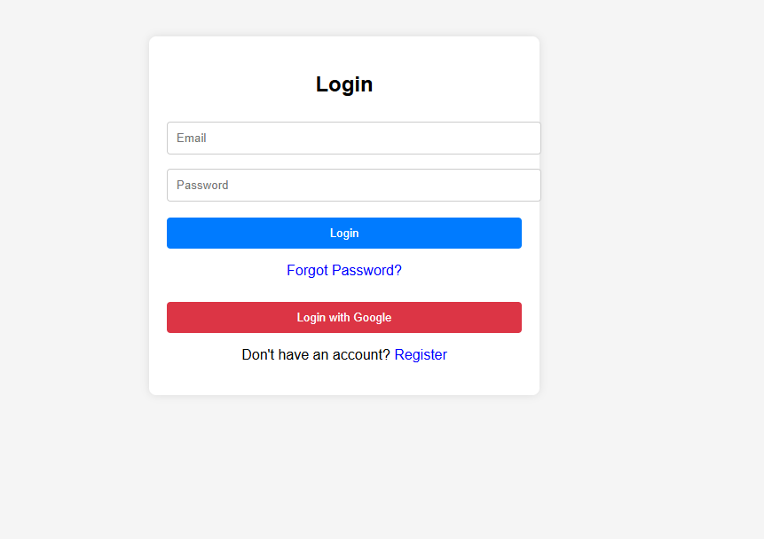
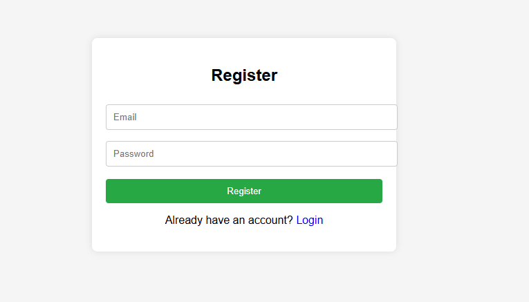

# 📌 Firebase Authentication System

The **Firebase Authentication System** is a secure and user-friendly web application built using **React.js** and **Firebase Authentication**. It provides a complete authentication system including user registration, login, password reset, profile management, and protected routes with real-time authentication state tracking.

---

## 🚀 Features

### 🔐 User Registration
- Sign up using email and password
- Social login support (Google, Facebook, GitHub)
- Optional email verification

### 🔑 User Login
- Secure login with email/password
- Social login support
- Persistent login sessions

### 🔄 Password Management
- Reset forgotten password via email
- Change password while logged in

### 🛡 Protected Routes / Dashboard
- Restrict access to authenticated users only
- Automatic redirection for unauthorized users

### 👤 User Profile Management
- Update display name
- Upload profile picture
- Manage user account details

### ⚡ Real-Time Authentication
- Live authentication state tracking
- UI updates automatically on login/logout

---

## 📚 Use Case

This system can be used in:
- SaaS applications
- Admin dashboards
- E-commerce platforms
- Any web application requiring secure authentication and access control

---

## 🛠 Tech Stack

- **Frontend:** React.js
- **Backend (Auth):** Firebase Authentication
- **Database (Optional):** Firebase Firestore / Realtime Database
- **Middleware:** Firebase SDK for JavaScript
- **Styling:** Tailwind CSS / Material UI
- **Deployment:** Firebase Hosting / Vercel

---

## 📁 ScreenShot

